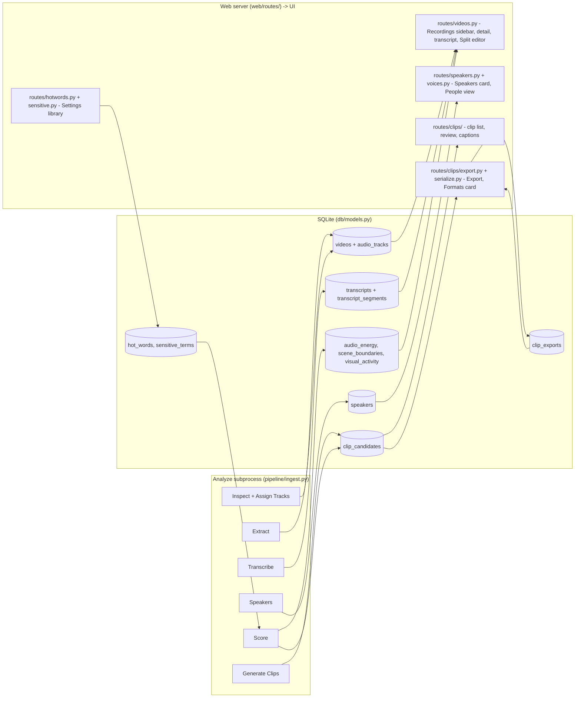

# YuuClip - architecture and landmines (human on-ramp)

Read this once before you touch the code. It gives you the mental model - how the
pieces fit and where the traps are - so you can add a feature or fix a bug without
stepping on the sharp edges that are otherwise only documented for the in-repo
assistant.

Where this sits in the docs:

- **[CONTRIBUTING.md](../../.github/CONTRIBUTING.md)** - setup, the `yuu-dev` CLI, and the PR
  process. Start there to get a working checkout.
- **This file** - the mental model plus the top landmines, in prose you read once. A
  new narrow-scope gotcha (a bug class, an import-order trap, a subprocess
  invariant) gets added here as a new numbered landmine, not restated in
  CLAUDE.md - that file should only ever point to this one, never duplicate it.
- **[LAYOUT.md](LAYOUT.md)** - the authoritative file-by-file map. When this doc says
  "see the layout map", it means that file.
- **[TESTING.md](TESTING.md)** - the system/golden/Electron test tiers and the
  isolated fixture server, past what the "Test tiers" section below covers.
- **[CLAUDE.md](../../CLAUDE.md)** - the exhaustive assistant-context file, carrying
  every convention. Do not expect to read all of it to get oriented - that is what
  this file is for.

---

## The mental model

### Pipeline flow

A recording moves through five stages. The first four are the analyze pipeline; the
last is a separate user action.

```
analyze  ->  transcribe  ->  score  ->  review  ->  export
```

- **Analyze** (code: `ingest`) orchestrates one recording end to end: inspect the file,
  label audio tracks, extract per-track WAV, detect overlapping tracks, transcribe,
  generate clip candidates, and score them. The orchestration lives in
  [pipeline/ingest.py](../../yuu_clip/pipeline/ingest.py).
- **Transcribe** runs speech-to-text per eligible track (Whisper by default) and stores
  segments.
- **Score** ranks each clip candidate on four axes - Funny, Dramatic, Action, Visual.
  Most of the signal is model-free (laughter, keyword lexicon, prosody, speech-rate,
  energy, scene cuts, on-screen motion); a local LLM *adds* a semantic read plus the
  written descriptions on top. The app is useful with no model installed - the LLM is
  additive, not load-bearing for ranking.
- **Review** is the web UI: a human approves, rejects, edits, and splits clips.
- **Export** cuts approved clips (and optional highlight reels) with captions and title
  cards.

The stage-by-stage mechanics live in
[docs/dev/CLI-AND-INTERNALS.md](CLI-AND-INTERNALS.md); the user-facing meaning of each
score is in the user feature guide.

### Process model: two processes, one SQLite file

This is the single most important thing to internalize.

- The **web server** (FastAPI, [web/app.py](../../yuu_clip/web/app.py)) serves the UI
  and the API. It is long-lived.
- **Analyze runs in a separate subprocess**, launched by the server with
  `--no-interact`. It is the thing doing the heavy CPU/GPU work. The server tracks it
  through `ctx.analyze_job` (an `AnalyzeJob`, [web/analyze_job.py](../../yuu_clip/web/analyze_job.py))
  for cancellation, reconnection, and clean shutdown.

Both processes open the **same SQLite database**. SQLite allows only one writer at a
time, so the two processes contend. Everything in the "SQLite discipline" landmine below
exists to keep that contention from turning into `database is locked` errors.

Progress from the subprocess reaches the browser over **SSE** (server-sent events); the
plumbing is in [web/sse.py](../../yuu_clip/web/sse.py). Long-running jobs on the frontend
go through the `startJobUI` / `endJobUI` / `streamSSE` helpers, not ad-hoc fetches.

### Data model

The schema has exactly one source of truth:
[db/models.py](../../yuu_clip/db/models.py). Everything below is derived from it -
when this section and the code disagree, the code wins. There is no migration
framework: `create_all()` plus an additive-column list (`_ADDITIVE_COLUMNS` in
`models.py`) is the whole story, so new columns must be nullable or carry a DEFAULT.

How data flows: each analyze stage writes its tables, and the web server's routes
read them back for the UI. (Hot-words and Sensitive Terms flow the other way - the
Settings UI writes them, and the Score stage reads them.)



The core entities, with the user-facing term from
[docs/dev/llm/GLOSSARY.md](llm/GLOSSARY.md) (say the user-facing term in UI copy,
the code name in code):

| Table (ORM class) | What it is | User-facing term | Written by | Read by |
| --- | --- | --- | --- | --- |
| `videos` (`Video`) | One row per source recording file: path, probe metadata, status, titles/summaries, scoring provenance, split-segment and session links | Recording | Analyze (Inspect/Assign Tracks upsert in `pipeline/ingest.py`); Summarize/Score stamp summary + provenance columns; splits add child rows | `routes/videos.py` -> Recordings sidebar + detail (`videos/videos.js`) |
| `sessions` (`RecordingSession`) | A group of recordings from one play session, with rollup title/summary | Session | Sessions UI (`routes/sessions.py`; auto-suggest logic in `yuu_clip/sessions.py`) - not the pipeline | `routes/sessions.py` -> session headers + unified timeline (`videos/sessions.js`) |
| `audio_tracks` (`AudioTrack`) | One audio stream in a recording: role (`label`), transcribe/score flags, extracted WAV path | Track (role: Track role) | Analyze Inspect/Assign Tracks; Extract fills `extracted_path` | Transcribe/Score stages; `routes/videos.py` track cards |
| `transcripts` (`Transcript`) | One speech-to-text run per eligible track (or per clip retranscription); `completed_at` NULL marks a truncated run | Transcript | Transcribe stage (`transcribe/whisper_runner.transcribe_track`); clip retranscribe (export flow) | Clip generation + scoring; transcript view and captions (`routes/videos.py`, `analyze/transcript.js`) |
| `transcript_segments` (`TranscriptSegment`) | One timed phrase: text, ms window, speaker attribution, optional per-word timings | Caption segment | Transcribe stage; caption edits + forced alignment (`transcribe/align.py`) rewrite text/words | Transcript view, caption (SRT) generation (`subtitles.py`), clip excerpts |
| `speakers` (`Speaker`) | Durable per-recording voice identity with name, voiceprint, and suggestion fields | Speaker | Speakers stage (`transcribe/speaker_attach.py`, from diarization clusters) | `routes/speakers.py` -> Speakers card (`people/speakers.js`); captions via `display_name` |
| `project_voices` (`ProjectVoice`) | Project-wide identity spanning recordings - naming it names every linked Speaker | Person / People | People view (`routes/voices.py`); analyze only ever *suggests* (`Speaker.suggested_voice_id`) | `routes/voices.py` -> People view (`people/voices.js`); `Speaker.display_name` resolution |
| `voice_exemplars` (`VoiceExemplar`) | One voiceprint contributed to a Person (multi-exemplar matching) | (internal - never named in UI) | Confirming a match in People view; matching core `transcribe/project_voice.py` | Cross-recording matching during analyze and the People backfill |
| `characters` (`Character`) | Structured lore entity in a world context (name, lore, score boost), linkable to a Person | Character | Context editor (`routes/characters.py`) | LLM scoring prompt (`contexts.format_character_block`); Person picker (`people/voices.js`) |
| `clip_candidates` (`ClipCandidate`) | A proposed highlight: ms window, `kind` (`clip`/`scene`), four axis scores + laugh, descriptions, status, export/staleness stamps | Clip (kind `scene`: Scene; status `pending`: Unreviewed) | Generate Clips (`segments/windower.py` + `visual_windower.py` + `merge.py`; scenes via `scene_segmenter.py`); manual clips (`routes/clips/crud.py`); Score stage fills scores (`scoring/engine.py`) | `routes/clips/` -> clip list + review UI (`clips/clips.js`); export + reel |
| `clip_exports` (`ClipExport`) | One exported file per (clip, export preset), with settings + size | Export file | Export (`export/render.py::_record_clip_export`) | `routes/clips/serialize.py` -> Exports card (`clips/clipexport.js`) |
| `audio_energy` (`AudioEnergy`) | Per-second RMS loudness curve per track | (internal - powers Audio energy scoring) | Score stage (`scoring/energy.py::compute_energy`) | `EnergyScorer`; recording detail routes (`routes/videos.py`) |
| `scene_boundaries` (`SceneBoundary`) | Detected visual scene-cut timecodes per recording (NOT the `kind='scene'` candidate type) | (internal - powers Scene scoring / the Visual axis) | Score stage (`scoring/scenes.py::compute_scenes`) | `SceneCutScorer`; `segments/scene_segmenter.py` + `visual_windower.py`; `routes/videos.py` |
| `visual_activity` (`VisualActivity`) | Per-sample frame-diff on-screen activity, model-free | (internal - powers the Visual axis) | Score stage (`analyze/motion.py::compute_activity`) | `scoring/visual.py`; `segments/windower.py` + `visual_windower.py`; `routes/videos.py` |
| `hot_words` (`HotWord`) | Creator phrase that boosts a clip's score when it appears in the transcript; global or context-scoped | Hot-word | Settings UI (`routes/hotwords.py`) | Score stage (`scoring/engine.py::apply_hotword_boosts` via `scoring/textmatch.py` + `term_scope.py`) |
| `sensitive_terms` (`SensitiveTerm`) | Creator privacy/censor term flagged (never scored) on matching clips; term text is PII - never log it | Sensitive Terms (Privacy Term / Censor Word) | Settings UI (`routes/sensitive.py`) | Score stage (`scoring/engine.py::apply_sensitive_scan`); the Flagged filter |

World contexts are deliberately **not** in this table: they live in `contexts.json`
(see [contexts.py](../../yuu_clip/contexts.py)), not the DB - which is why
`context_slug` columns are plain strings, never foreign keys.

### The swappable-backend seam

Every model-backed capability sits behind the same shape, so a backend can be swapped or
added without touching callers. This is a hard convention - keep it even where there is
only one implementation today.

The shape is always:

- an **ABC** (or `Protocol`) defining the capability, exposing an availability probe
  `available() -> (ok, reason)`;
- a single **`make_*(config)` factory** keyed on a `*_backend` config value, with a
  `_BACKEND_*` lookup table;
- callers go **only** through the factory. They never import a concrete backend class,
  and there is no caller-side `if backend == ...`.

The canonical example is the LLM seam:
[scoring/llm_client.py](../../yuu_clip/scoring/llm_client.py) - `LLMClient` (ABC),
`make_client` ([llm_client.py:167](../../yuu_clip/scoring/llm_client.py#L167)) keyed on
`llm_backend`, `_BACKEND_CLIENTS` ([llm_client.py:158](../../yuu_clip/scoring/llm_client.py#L158)),
with `LlamaCppServerClient` (local) and `NullLLMClient`
([llm_client.py:112](../../yuu_clip/scoring/llm_client.py#L112)) as the fallback.
`make_client` is also the single point that enforces AI-privacy policy - it returns
`NullLLMClient` when generative AI is off. YuuClip is local-only by design; there is no
remote/hosted backend and no "send my transcript to an API" path.

The other seams follow the same pattern: transcription (`Transcriber` +
`make_transcriber`), diarization (`DiarizationClient` + `make_diarization_client`),
similarity/embeddings (`make_backend`), and scorers (the `Scorer` `Protocol` in
[scoring/protocol.py](../../yuu_clip/scoring/protocol.py), assembled by
[scoring/scorer_set.py](../../yuu_clip/scoring/scorer_set.py)). To add a backend:
implement the interface, register it in that module's `_BACKEND_*` dict, add the
`*_backend` value. The full seam list is in CLAUDE.md ("AI/model backends must sit
behind a swappable interface").

### Test tiers

Tests are split into four tiers **by directory**, not by pytest markers. Pick the tier
by what the test needs; the `yuu-dev` command names map straight onto them.

- **unit** ([tests/unit/](../../tests/unit/)) - pure Python: no live server, no
  TestClient, no seeded DB, no real model packages or HF cache. Must pass offline on any
  machine. The tier is guarded: [tests/unit/conftest.py](../../tests/unit/conftest.py) is
  deliberately empty of DB/server fixtures, and `test_no_integration_imports.py` fails if
  a unit test imports the web app. A test that references `project_dir`/`client` fails at
  collection - that means it belongs in `integration`.
- **integration** ([tests/integration/](../../tests/integration/)) - route and pipeline
  tests that need the seeded DB and an in-process FastAPI `TestClient` (the `project_dir`
  + `client` fixtures). No browser.
- **ui** ([tests/ui/](../../tests/ui/)) - Playwright against a **live** server that
  `yuu-dev test-ui` stands up itself: a disposable, freshly-seeded fixture project
  served on a free port with isolated config, torn down after the run
  ([yuu_clip/dev/uiserver.py](../../yuu_clip/dev/uiserver.py)) - nothing needs to be
  serving `:8080`. Slow and browser-bound. Keep only what genuinely needs a real
  browser here: navigation, SSE transport, focus traps, live `getComputedStyle` /
  real geometry.
- **js** ([tests/js/](../../tests/js/)) - the web UI's pure module logic under **vitest +
  happy-dom**: import the ESM module directly and assert on its output (formatters,
  filters, parse/score math, the job-pill state machine driven through its public API).
  No browser, no server, ~6s. This is the preferred home for any pure/DOM-shell JS helper;
  a Playwright case that only pokes module state via `page.evaluate` should be rewritten to
  drive the public API under vitest fake timers instead.

Each tier has its own command: `yuu-dev test-unit` runs unit, `yuu-dev test-integration`
runs integration, and `yuu-dev test-api` is the convenience combo of the two (the pre-done
gate); `yuu-dev test-ui` runs ui (see CLAUDE.md for the `--changed` / `--smoke` cadence);
`yuu-dev test-js` runs js. `yuu-dev test-all` runs every server-free tier in one go
(js + unit + integration, but not ui - a missing Node toolchain skips js rather than
failing). The fast inner loop is `test-unit` (+ `test-js` when `static/*.js` changed); run
`test-js` after editing any `static/*.js` that has (or should have) a `tests/js/`
counterpart. CI runs lint, typecheck, test-api, and test-js; the ui tier stays local.

---

## The landmines

These are the traps that bite people who have only read CONTRIBUTING.md. Each is real
and each has bitten before.

### 1. Frontend: edit the source modules, then rebundle

The web UI is real ESM: ~40 `import`/`export` modules under
[web/static/](../../yuu_clip/web/static/), grouped into feature subdirectories
(`core/`, `videos/`, `clips/`, `analyze/`, `settings/`, `people/`, `library/`). Imports
are relative, so a module's bucket is part of its path - e.g. `videos/videos.js` imports
`escHtml` from `'../core/utils.js'`. [main.esm.js](../../yuu_clip/web/static/main.esm.js)
is the entry point: it imports the whole graph, with
[core/boot.js](../../yuu_clip/web/static/core/boot.js) (first-paint) imported **last**.

**The build step is the gotcha.** `index.html` loads exactly one script -
[bundle.esm.js](../../yuu_clip/web/static/bundle.esm.js), the committed esbuild artifact
built from the `main.esm.js` graph by `yuu-dev bundle`
([scripts/build-esm.mjs](../../scripts/build-esm.mjs)). The browser never loads the
individual `static/*.js` files. So **after editing any `static/*.js` you must run
`yuu-dev bundle`** or the running server keeps serving the stale bundle and your change
does not appear. Never hand-edit `bundle.esm.js` - edit the source module and rebundle.
[tests/unit/test_bundle_drift.py](../../tests/unit/test_bundle_drift.py) fails if you
commit a stale bundle (it skips when the Node toolchain is absent, so `test-api` still
passes offline). Rebuilding needs Node + `npm install`; the committed artifact is what
ships, so Node is never needed to *run* the app.

**`index.html` is also a build artifact.** It is stitched from
[index.src.html](../../yuu_clip/web/static/index.src.html) (the page shell, a readable
table-of-contents of `<!-- @@include ... -->` markers) plus one file per modal/region
under [static/partials/](../../yuu_clip/web/static/partials/), by the same `yuu-dev bundle`
step ([yuu_clip/dev/htmlstitch.py](../../yuu_clip/dev/htmlstitch.py)). So the landmine
extends: **edit the partials or `index.src.html`, never the committed `index.html`** - it
is overwritten on the next stitch, exactly like `bundle.esm.js`. The stitch is byte-exact
and pure Python (no Node), so its guard
[tests/unit/test_index_html_drift.py](../../tests/unit/test_index_html_drift.py) always
runs. Adding a region: create the partial, add an `<!-- @@include path -->` marker in
`index.src.html`, run `yuu-dev bundle`.

**The residual `window.X = X` shim.** [main.esm.js](../../yuu_clip/web/static/main.esm.js)
still ends with a shrinking block that re-publishes some names onto `window`. This is a
*compatibility shim being retired*, not the architecture - a name stays on it only while
(1) another already-ESM module still reads it as `window.foo` instead of importing it, or
(2) a Playwright `page.evaluate` pokes it as a page global. Prefer `import` over
`window.foo` for any new cross-module reference; converting the remaining `window.*` read
sites to imports and deleting the `page.evaluate` pokes is what drains the shim toward
empty. (This ESM architecture replaced the original all-`window`-globals,
`Object.assign(window, {...})` design; if you find a doc or comment describing that older
pattern as current, it is stale.)

### 2. Two parallel model-selection stacks - layout differs, data is generated

Model selection exists in **two separate stacks that cannot share runtime code**. The
*wiring* differs by runtime; the *data* is generated once so it can't drift.

- **In-app Settings** - browser JS (`settings/settings.js`, `settings/modelcatalog.js`)
  -> HTTP -> Python [model_catalog.py](../../yuu_clip/model_catalog.py) + the
  `download-gguf` CLI.
- **Electron setup wizard** - renderer (`electron/setup.html`) -> IPC ->
  [electron/main.js](../../electron/main.js) handler `setup:download-gguf-model`
  ([main.js:341](../../electron/main.js#L341)), which downloads `DEFAULT_LLAMACPP_MODEL`
  ([electron/constants.js](../../electron/constants.js)) with Node and writes
  `config.json` directly.

They genuinely cannot be DRY-ed at runtime: different runtimes (browser vs Electron/Node),
and the wizard runs **before the Python server exists**, so it cannot call the endpoints
Settings depends on.

**The data both stacks read is generated, not hand-synced.**
`yuu-dev shared-data` ([yuu_clip/dev/shareddata.py](../../yuu_clip/dev/shareddata.py))
bakes the recommended model, whisper models + languages, content presets, and AI-privacy
copy from the Python sources of truth into `catalog-data.json`, written to two committed
copies: `yuu_clip/web/static/shared/` (web) and `electron/shared/` (wizard). The wizard's
`constants.js`/`recommend-model.js` `require()` the JSON, and the wizard renderer
(`setup-renderer.js`) imports it at build time into `setup.bundle.js`. `yuu-dev bundle`
already regenerates this (it runs shared-data before building the ESM bundles), so the
normal after-edit `yuu-dev bundle` habit covers touching
`model_catalog.py` / `config.py` / `content_presets.py` / `whisper_catalog.py` too - run
`yuu-dev shared-data` directly only for a data-only edit where nothing else needs
rebundling. `tests/unit/test_shared_data_drift.py` guards it. Consequences:

- `DEFAULT_LLAMACPP_MODEL` and `recommend-model.js` are lookups into the generated
  `recommended_model` (= `model_catalog.text_models()[0]`), not literals - do not
  re-hardcode them.
- The wizard only ever sets the **text** model (`llm_model_path`), so `recommended_model`
  must stay a text (non-vision) entry (enforced in `test_shared_data_drift.py`). If the
  wizard ever gains vision-model selection it must write `llm_vision_model_path`, never
  `llm_model_path` - a vision download must not clobber the text scorer.

**Shared UI layer + its boundary rule.** Beyond the data, the two stacks share real ESM
modules under `yuu_clip/web/static/shared/` (currently `escapehtml.js` and
`whisperlang.js`, the transcription-language `<option>` builder) plus `tokens.css`, the
theme-token palette. The JS modules are imported at *build time* into both bundles - the
web `bundle.esm.js` (esbuild graph from `main.esm.js`) and the wizard `setup.bundle.js`
(second esbuild entry from `electron/setup-renderer.js`). `tokens.css` is linked before
`app.css` in the web app and mirrored (with the Oxanium font) into `electron/shared/` by
`yuu-dev shared-data` for the wizard, which links it directly - so the wizard renders in
the app's real palette instead of a parallel hardcoded one. **Boundary rule: a `static/shared/` module takes data +
callbacks and returns values/markup - it never `fetch`es or does IPC itself.** Settings
feeds it HTTP-backed state; the wizard feeds it catalog/IPC-backed state. That is what
lets one module serve both runtimes. (The two model-card *renderers* are deliberately
NOT shared - the Settings card has active/installed/download states and text/vision
groups the wizard's single recommended-model row doesn't, so forcing one renderer would
be speculative generality.)

### 3. SpeechBrain must not be imported before `transformers.pipeline` resolves

Importing `speechbrain` before `transformers.pipeline` is first resolved forces that
resolution to load speechbrain's k2 integration, which hard-imports the unbundled `k2`
package and dies with `ModuleNotFoundError: k2`. In the analyze subprocess, diarization
(speechbrain) runs before scoring (transformers), so audio-event and laugh scoring would
silently die for the whole run.

The fix is a pre-warm: `ingest.py` resolves `transformers.pipeline` via
`prewarm_transformers_pipeline()` ([ingest.py:239-240](../../yuu_clip/pipeline/ingest.py#L239-L240))
*before* diarization imports speechbrain. If you reorder the analyze pipeline, keep that
call ahead of any speechbrain import.

This only surfaces with the real packages installed - the pytest venv mocks both, so it
passes tests and fails in a real offline install. Re-verify against a real install when
you touch pipeline ordering.

### 4. SQLite single-writer discipline

Because the server and the analyze subprocess share one SQLite file (see the process
model above), three rules are non-negotiable:

- **`NullPool` on every engine.** Set in `make_engine`
  ([db/models.py:73](../../yuu_clip/db/models.py#L73)). Connections close immediately so
  a pooled server connection cannot hold a lock and block the subprocess's INSERT. Never
  change this to a pooled class. A 30 s `busy_timeout` PRAGMA
  ([db/models.py:91](../../yuu_clip/db/models.py#L91)) gives a blocked writer time to wait
  rather than fail instantly.
- **Every route handler that opens a session must close it in `try/finally`.** See the
  pattern in [routes/videos.py:82-95](../../yuu_clip/web/routes/videos.py#L82-L95). A
  leaked session is a held connection is a lock.
- **If you see `OperationalError: database is locked`:** the usual cause is a zombie
  analyze subprocess still holding the file (kill it and restart the server), or a route
  handler leaking a session, or the server not being restarted after a Python change.

### 5. Schema changes go through Alembic (never wipe-and-recreate)

The project DB is a user's library and must survive an app update that changes the
schema. The schema is versioned by **Alembic** ([yuu_clip/db/migrations/](../../yuu_clip/db/migrations/)):

- **On startup the server auto-migrates to head** after a timestamped backup of the
  SQLite file, before it serves a request or launches the analyze subprocess
  ([db/migrate.py](../../yuu_clip/db/migrate.py), called from `ProjectContext`). A user
  never runs a command; a failed upgrade leaves the backup intact and refuses to serve
  rather than corrupt data. Only the server migrates - the analyze subprocess opens the
  DB only after the server has brought it to head.
- **Forward-only.** There are no down-revisions; recovery from a bad upgrade is restoring
  the `*.pre-migration-*.bak` file, not `alembic downgrade`.
- **`make_engine`'s `create_all` still builds a brand-new DB in full**, which is then
  stamped at the current revision; migrations are what evolve an *existing* DB. The
  schema-drift guard ([tests/unit/test_migration_drift.py](../../tests/unit/test_migration_drift.py))
  fails if a model changes without a matching migration - the enforced replacement for
  the retired hand-maintained additive-column list.
- **To change the schema:** edit `db/models.py`, run `yuu-dev migrate-new "message"`,
  **review** the generated script (SQLite needs batch ops for anything but an add-column;
  autogenerate output is never blindly trusted), and commit the model + revision together.
  See [CONTRIBUTING.md](../../.github/CONTRIBUTING.md) "Changing the database schema".

### 6. Interactive labeling never runs from the web UI

[`label_tracks()`](../../yuu_clip/analyze/labeler.py#L32) prompts on stdin when a
recording's audio tracks are ambiguous - fine for a human running the CLI directly,
fatal for a subprocess launched by the web server (it would hang forever with no
TTY). The CLI's `analyze` command always passes `--no-interact`, which routes
through [`_label_non_interactive()`](../../yuu_clip/analyze/labeler.py#L91) instead:
it uses track 0 as the combined track and leaves the rest unlabeled without
prompting. Never call `label_tracks()` interactively from a web-triggered code path.

### 7. Subprocess cancellation is proc-identity-keyed, not a flag

Every cancel endpoint (`/api/analyze/cancel` and the export/score/retranscribe/
stage-rerun equivalents) adds the process it kills to `ctx.cancelled_procs` (a set,
maintained the same way as `subprocess_procs`/`counted_procs` - see
[web/sse.py](../../yuu_clip/web/sse.py)); `subprocess_sse`'s tail checks
`proc in ctx.cancelled_procs` (then discards the entry) to report
`outcome="cancelled"` over SSE. Because membership is identity-keyed, a stale entry
from a prior job can never mark a later, different process as cancelled - every
subprocess job carries a typed cancel with no per-job opt-in required. The leak
guarantee (entries are discarded in the generator's `finally`, so the set never
grows) is pinned by `test_score_after_a_cancel_does_not_report_itself_as_cancelled`.

### 8. `.ps1` files with non-ASCII need a UTF-8 BOM

Windows PowerShell 5.1 decodes a `.ps1` file with no BOM as the OS legacy codepage
(cp1252), not UTF-8. A stray em-dash, box-drawing character, or smart quote then
decodes into a byte PowerShell reads as a string delimiter, producing a "missing
terminator" parse error far from the actual character. A UTF-8 BOM (`EF BB BF`)
forces correct decoding and prevents this; ASCII-only scripts don't need one.
[tests/unit/test_ps1_bom.py](../../tests/unit/test_ps1_bom.py) enforces it for
`scripts/*.ps1`.

---

## Where do I change X?

| Task | Go to |
| --- | --- |
| **Add a scoring axis / signal** | Implement the `Scorer` `Protocol` ([scoring/protocol.py](../../yuu_clip/scoring/protocol.py)) and wire it into `build_clip_scorers` ([scoring/scorer_set.py:19](../../yuu_clip/scoring/scorer_set.py#L19)) so full-rescore picks it up. |
| **Add an API route** | Add a module under [web/routes/](../../yuu_clip/web/routes/) and follow the `try/finally: db.close()` pattern in [routes/videos.py](../../yuu_clip/web/routes/videos.py). |
| **Add a Settings control** | Both the browser JS (`settings/settings.js`) and the Python config/catalog side. If it selects a model, remember landmine #2 - mirror it in the Electron wizard by hand. |
| **Add a model backend** (LLM, transcription, diarization, similarity) | Implement the seam's ABC/Protocol, register it in that module's `_BACKEND_*` dict, add the `*_backend` config value. Never add a caller-side `if backend == ...`. Start from the LLM seam in [scoring/llm_client.py](../../yuu_clip/scoring/llm_client.py). |
| **Add or edit a frontend module** | Edit the source `static/<bucket>/*.js`, `export` its public surface and `import` what it needs, then run `yuu-dev bundle` and `yuu-dev test-js` (landmine #1). Never edit `bundle.esm.js` by hand. |
| **Edit a modal / page region (markup)** | Edit the partial under `static/partials/` (or `static/index.src.html` for the shell), then run `yuu-dev bundle` to re-stitch `index.html` (landmine #1). Never hand-edit the committed `index.html`. |
| **Change the analyze pipeline order** | [pipeline/ingest.py](../../yuu_clip/pipeline/ingest.py) - keep the `prewarm_transformers_pipeline()` call ahead of any speechbrain import (landmine #3). |
| **Change the DB schema** | Edit [db/models.py](../../yuu_clip/db/models.py), run `yuu-dev migrate-new "message"`, review the generated Alembic revision (batch ops on SQLite), commit both together (landmine #5). |
| **Find any other file** | The full file-by-file map is [docs/dev/LAYOUT.md](LAYOUT.md). |

---

## Terminology

User-facing text uses the glossary terms in
[docs/dev/llm/GLOSSARY.md](llm/GLOSSARY.md), even where the code identifier differs (the
UI says "Analyze", the code says `ingest`; the UI says "World context", the code says
`world_context`). Define a concept in the glossary before introducing it, and use the
user-facing term in conversation too.
